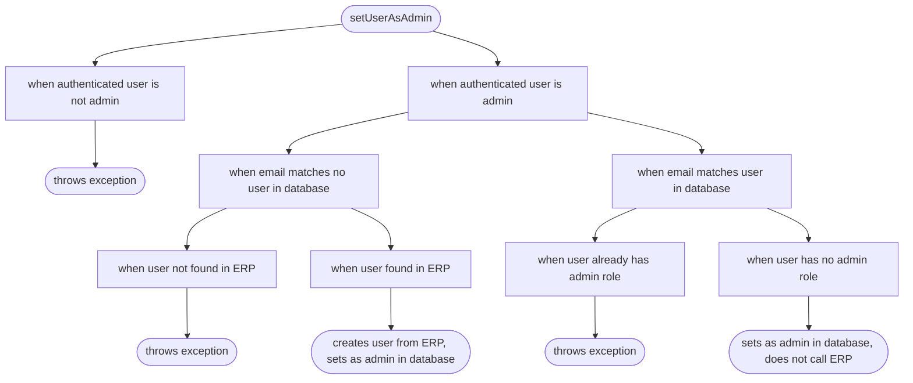

# speccharts [](https://www.npmjs.com/package/speccharts)

Based on test suites in your source code, generate diagrams that reveal your application specs.

From this spec file:

```ts
describe("setUserAsAdmin", () => {
  describe("when authenticated user is not admin", () => {
    it("throws exception", () => {
      // …
    });
  });

  describe("when authenticated user is admin", () => {
    describe("when email matches no user in database", () => {
      describe("when user not found in ERP", () => {
        it("throws exception", () => {
          // …
        });
      });

      describe("when user found in ERP", () => {
        it("creates user from ERP, sets as admin in database", () => {
          // …
        });
      });
    });

    describe("when email matches user in database", () => {
      describe("when user already has admin role", () => {
        it("throws exception", () => {
          // …
        });
      });

      describe("when user has no admin role", () => {
        it("sets as admin in database, does not call ERP", () => {
          // …
        });
      });
    });
  });
});
```

…get this Mermaid flowchart:



## Principle

Test suites tend to become less legible as they grow. At some point, you wonder where a new test belongs or if a case might not be already covered.
These problems are only bound to increase with the advent of AI agents that contribute code you never wrote.

speccharts reads your test files and generates Mermaid flowcharts that give a bird's eye view of test suites. `describe` blocks render as nodes, `it` and `test` blocks render as leaves.

## Why the Mermaid format

Mermaid is a plain text diagram representation.

Mermaid files (typically `.mmd`) can be:

- viewed on GitHub (native Mermaid rendering)
- viewed in your IDE (install [Mermaid Preview](https://marketplace.visualstudio.com/items?itemName=vstirbu.vscode-mermaid-preview) for Visual Studio Code)
- viewed on GitBook, Notion, or Confluence
- exported as images using Mermaid CLI
- embedded in Markdown documentation

## Command-line interface

### ✏️📄 Generate a single Markdown chartbook

```sh
npx speccharts -i "src/**/*.{spec,test}.{ts,tsx}" --single-output-file speccharts.md
```

This creates a `speccharts.md` file [such as this one](./speccharts.md).

### ⤵️ Pipe Markdown chartbook to standard output

```sh
npx speccharts -i "src/**/*.{spec,test}.{ts,tsx}"
```

Ideal to pipe output to documentation outside of the repository.

### ✏️📒 Generate multiple chart files

```sh
npx speccharts -i "src/**/*.{spec,test}.{ts,tsx}" --multiple-output-files
```

This creates a Mermaid file next to each spec file:

```
src/
├── services/
│   ├── UserService.spec.ts
│   └── UserService.spec.ts.mmd  ← Generated
└── admin/
    ├── setUserAsAdmin.spec.ts
    └── setUserAsAdmin.spec.ts.mmd  ← Generated
```

### 🧹 Delete existing charts before generating new ones

```sh
npx speccharts -i "src/**/*.{spec,test}.{ts,tsx}" --multiple-output-files --delete-existing-charts
```

Useful if you deleted or moved spec files since last generation.

## JavaScript (TypeScript) API

```sh
npm install --save-dev speccharts
```

```ts
import { SpecChartsGenerator } from "speccharts";

const generator = new SpecChartsGenerator();

console.log(
  await generator.generate({
    inputFilePatterns: ["src/**/*.spec.{ts,tsx}"],
  })
);
```

## Other specification formats supported

### Question marks in spec files

### Jest table syntax

```ts
describe("math operations", () => {
  describe.each([
    [1, 2, 3],
    [4, 5, 9],
    [0, 0, 0],
  ])("addition: %d + %d = %d", (a, b, expected) => {
    it("should add numbers correctly", () => {
      expect(a + b).toBe(expected);
    });
  });

  test.each([
    ["positive", 5, 3, 2],
    ["negative", -5, -3, -2],
    ["zero", 0, 0, 0],
  ])("subtraction with %s numbers: %d - %d = %d", (type, a, b, expected) => {
    expect(a - b).toBe(expected);
  });
});
```

## Use cases

- **Documentation**: Generate visual documentation of use cases that non-tech collaborators can understand
- **Code reviews**: Help reviewers understand complex test scenarios at a glance
- **Onboarding**: Help new team members understand the application behavior through test structure
- **Testing strategy**: Visualize test organization and identify gaps in test coverage

## Supported test frameworks

- Jest (primary support)
- Compatible with any testing framework that uses `describe`/`it` or `describe`/`test` syntax

## Contributing

Contributions are welcome! Please feel free to submit a Pull Request.
