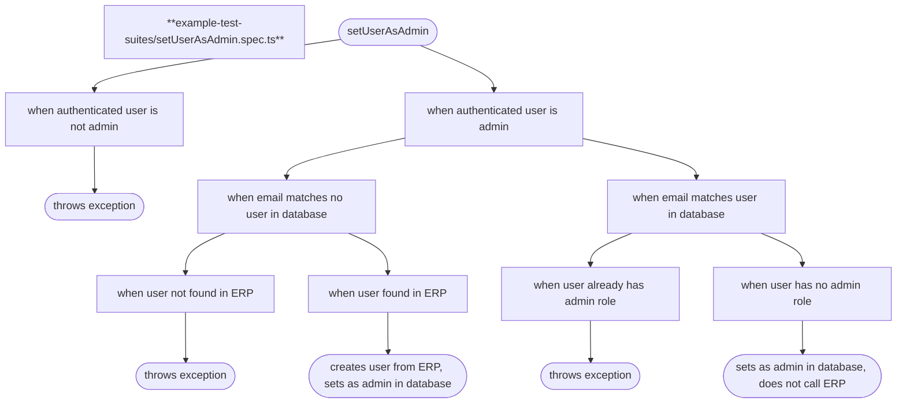

# speccharts

Based on test suites in your source code, generate diagrams that reveal your application specs.

From this spec file:

```ts
describe("setUserAsAdmin", () => {
  describe("when authenticated user is not admin", () => {
    it("throws exception", () => {
      // …
    });
  });

  describe("when authenticated user is admin", () => {
    describe("when email matches no user in database", () => {
      describe("when user not found in ERP", () => {
        it("throws exception", () => {
          // …
        });
      });

      describe("when user found in ERP", () => {
        it("creates user from ERP, sets as admin in database", () => {
          // …
        });
      });
    });

    describe("when email matches user in database", () => {
      describe("when user already has admin role", () => {
        it("throws exception", () => {
          // …
        });
      });

      describe("when user has no admin role", () => {
        it("sets as admin in database, does not call ERP", () => {
          // …
        });
      });
    });
  });
});
```

…get this Mermaid flowchart ([show as plain text](https://github.com/arnaudrenaud/speccharts/blob/main/speccharts/setUserAsAdmin.spec.ts.mmd?short_path=37f24c6)):



## Command-line interface

```sh
npx speccharts -i "src/**/*.{spec,test}.{ts,tsx}" -o speccharts
```

Output:

```
🔎 Found 3 spec files:
src/app/page.spec.tsx
src/services/Service.spec.ts
src/e2e/index.e2e.spec.ts

✏️ Wrote 3 chart files:
speccharts/page.spec.tsx
speccharts/Service.spec.ts
speccharts/index.e2e.spec.ts
```
