# speccharts [](https://www.npmjs.com/package/speccharts)

Based on test suites in your source code, generate diagrams that reveal your application specs.

From this spec file…

```ts
describe("sendRequest", () => {
  describe("when server responds", () => {
    describe("with success status", () => {
      describe("when body valid JSON", () => {
        it("returns parsed body", async () => {});
      });

      describe("when body invalid JSON", () => {
        it("throws MALFORMED_RESPONSE", async () => {});
      });
    });

    describe("with error status", () => {
      describe("when error message matches known exception", () => {
        it("re-throws exception", async () => {});
      });

      describe("when error message unknown", () => {
        describe("when status 4xx", () => {
          it("throws MALFORMED_REQUEST", async () => {});
        });

        describe("when status 5xx", () => {
          it("throws INTERNAL_SERVER_ERROR", async () => {});
        });
      });
    });
  });

  describe("when server does not respond", () => {
    it("throws SERVER_TIMEOUT", async () => {});
  });
});
```

…get this Mermaid flowchart:


## Principle

Test suites tend to become less legible as they grow. At some point, you wonder where to write a new test or if a case might not be already covered. This gets worse with AI agents that contribute code you never wrote.

`speccharts` reads your test files (JS or TS) and generates Mermaid flowcharts that give a bird's eye view of test suites. `describe` blocks render as nodes, `it` and `test` blocks render as leaves.

It works especially well with deeply nested test suites, which can help to convey ramified logic.

## Language and syntax support

For now, only JavaScript and TypeScript test files are supported.

Any files that use `describe > it` or `describe > test` syntax are supported.

## Command-line interface

### ✏️📄 Generate a single Markdown file with all charts

```sh
npx speccharts -i "src/**/*.{spec,test}.{ts,tsx}" --single-output-file speccharts.md
```

This gathers all charts into a `speccharts.md` file [such as this one](./speccharts.md).

### ✏️📒 Generate multiple chart files

```sh
npx speccharts -i "src/**/*.{spec,test}.{ts,tsx}" --multiple-output-files
```

This creates a Mermaid file next to each spec file:

```
src/
├── http/
│   ├── sendRequest.spec.ts
│   └── sendRequest.spec.ts.mmd  ← Generated
└── services/
    ├── getUser.spec.ts
    └── getUser.spec.ts.mmd  ← Generated
```

### 🧹 Delete existing charts before generating new ones

```sh
npx speccharts -i "src/**/*.{spec,test}.{ts,tsx}" --multiple-output-files --delete-existing-charts
```

Useful if you deleted or moved spec files since last generation.

### ⤵️ Pipe Markdown to standard output

```sh
npx speccharts -i "src/**/*.{spec,test}.{ts,tsx}"
```

Instead of writing all charts to a file, send Markdown content to standard output.

## JavaScript (TypeScript) API

```sh
npm install --save-dev speccharts
```

```ts
import { SpecChartsGenerator } from "speccharts";

const generator = new SpecChartsGenerator();

console.log(
  await generator.generate({
    inputFilePatterns: ["src/**/*.spec.{ts,tsx}"],
  })
);
```

## Supported syntax variants

### Questions (decision node)

`describe` blocks ending with a question mark render as decision nodes (rhombus-shaped).

Example spec:

```ts
describe("getUser", () => {
  describe("is store available?", () => {
    describe("no", () => {
      it("returns `null`", async () => {});
    });

    describe("yes", () => {
      describe("is user found?", () => {
        describe("no", () => {
          it("returns `null`", async () => {});
        });

        describe("yes", () => {
          it("returns user", async () => {});
        });
      });
    });
  });
});
```

Resulting chart:


### Tables

Blocks with [Jest table syntax](https://jestjs.io/docs/api#describeeachtablename-fn-timeout) render as a table.

Example spec:

```ts
describe("getInitials", () => {
  test.each([
    ["empty name", "no initials", "", ""],
    ["one-word name", "one initial", "John", "J"],
    ["two-word name", "two initials", "John Doe", "JD"],
    ["lowercase name", "two initials", "john doe", "JD"],
    ["three-word name", "three initials", "John Steve Doe", "JSD"],
    ["four-word name", "three initials", "John Steve Doe Barry", "JSD"],
  ])("%s → %s: %p → %p", (name, behavior, input, output) => {
    expect(getInitials(input)).toEqual(output);
  });
});
```

Resulting chart:



```mermaid
flowchart TD
N0(["getInitials"])
N1("<table style='text-align: left;'><tr><td style='font-family: monospace; padding: 0 8px 8px 8px'>empty name</td><td style='padding: 0 8px 8px 8px'>→</td><td style='font-family: monospace; padding: 0 8px 8px 8px'>no initials</td><td style='padding: 0 8px 8px 8px'>:</td><td style='font-family: monospace; padding: 0 8px 8px 8px'></td><td style='padding: 0 8px 8px 8px'>→</td><td style='font-family: monospace; padding: 0 8px 8px 8px'></td></tr><tr><td style='font-family: monospace; padding: 8px'>one-word name</td><td style='padding: 8px'>→</td><td style='font-family: monospace; padding: 8px'>one initial</td><td style='padding: 8px'>:</td><td style='font-family: monospace; padding: 8px'>John</td><td style='padding: 8px'>→</td><td style='font-family: monospace; padding: 8px'>J</td></tr><tr><td style='font-family: monospace; padding: 8px'>two-word name</td><td style='padding: 8px'>→</td><td style='font-family: monospace; padding: 8px'>two initials</td><td style='padding: 8px'>:</td><td style='font-family: monospace; padding: 8px'>John Doe</td><td style='padding: 8px'>→</td><td style='font-family: monospace; padding: 8px'>JD</td></tr><tr><td style='font-family: monospace; padding: 8px'>lowercase name</td><td style='padding: 8px'>→</td><td style='font-family: monospace; padding: 8px'>two initials</td><td style='padding: 8px'>:</td><td style='font-family: monospace; padding: 8px'>john doe</td><td style='padding: 8px'>→</td><td style='font-family: monospace; padding: 8px'>JD</td></tr><tr><td style='font-family: monospace; padding: 8px'>three-word name</td><td style='padding: 8px'>→</td><td style='font-family: monospace; padding: 8px'>three initials</td><td style='padding: 8px'>:</td><td style='font-family: monospace; padding: 8px'>John Steve Doe</td><td style='padding: 8px'>→</td><td style='font-family: monospace; padding: 8px'>JSD</td></tr><tr><td style='font-family: monospace; padding: 8px 8px 0 8px'>four-word name</td><td style='padding: 8px 8px 0 8px'>→</td><td style='font-family: monospace; padding: 8px 8px 0 8px'>three initials</td><td style='padding: 8px 8px 0 8px'>:</td><td style='font-family: monospace; padding: 8px 8px 0 8px'>John Steve Doe Barry</td><td style='padding: 8px 8px 0 8px'>→</td><td style='font-family: monospace; padding: 8px 8px 0 8px'>JSD</td></tr></table>")
N0 --> N1
```

## Why the Mermaid format

Mermaid is a plain text diagram representation.

Mermaid files (typically `.mmd`) can be:

- viewed on GitHub (native Mermaid rendering)
- embedded in Markdown documentation
- viewed in your IDE (install [Mermaid Preview](https://marketplace.visualstudio.com/items?itemName=vstirbu.vscode-mermaid-preview) for Visual Studio Code)
- viewed on GitBook, Notion, or Confluence
- exported as images using Mermaid CLI

## Use cases

- documentation & onboarding: supply non-tech collaborators and new team members with visual, up-to-date specifications
- code reviews: help reviewers understand complex test suites at a glance
- testing strategy: identify imbalances between test suites

To add chart generation to a CI pipeline, see GitHub action example: [push-main.yml](.github/workflows/push-main.yml).
