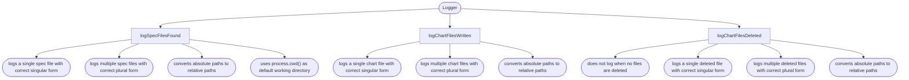

# speccharts

Jump to chart for each spec file:

<pre>└── src/     ├── SpecChartsGenerator/     │   ├── <a href="#src-SpecChartsGenerator-SpecChartsGeneratorspects">SpecChartsGenerator.spec.ts</a>     │   ├── core/     │   │   ├── getChart/     │   │   │   └── <a href="#src-SpecChartsGenerator-core-getChart-getChartspects">getChart.spec.ts</a>     │   │   └── getSpecTree/     │   │       ├── <a href="#src-SpecChartsGenerator-core-getSpecTree-getSpecTreespects">getSpecTree.spec.ts</a>     │   │       └── <a href="#src-SpecChartsGenerator-core-getSpecTree-getTableSyntaxSpecTreespects">getTableSyntaxSpecTree.spec.ts</a>     │   └── helpers/     │       └── <a href="#src-SpecChartsGenerator-helpers-logspects">log.spec.ts</a>     ├── chart-files/     │   ├── getChartFiles/     │   │   └── <a href="#src-chart-files-getChartFiles-getChartFilesspects">getChartFiles.spec.ts</a>     │   └── getChartsInSingleFile/     │       └── <a href="#src-chart-files-getChartsInSingleFile-getChartsInSingleFilespects">getChartsInSingleFile.spec.ts</a>     ├── cli/     │   └── integ.spec/     │       └── <a href="#src-cli-integspec-cliintegspects">cli.integ.spec.ts</a>     └── generateLocalFileSystem/         └── <a href="#src-generateLocalFileSystem-generateLocalFileSystemintegspects">generateLocalFileSystem.integ.spec.ts</a> </pre>

---

Spec file: <a id="src-SpecChartsGenerator-SpecChartsGeneratorspects" href="src/SpecChartsGenerator/SpecChartsGenerator.spec.ts">src/SpecChartsGenerator/SpecChartsGenerator.spec.ts</a>

---

Spec file: <a id="src-SpecChartsGenerator-core-getChart-getChartspects" href="src/SpecChartsGenerator/core/getChart/getChart.spec.ts">src/SpecChartsGenerator/core/getChart/getChart.spec.ts</a>

---

Spec file: <a id="src-SpecChartsGenerator-core-getSpecTree-getSpecTreespects" href="src/SpecChartsGenerator/core/getSpecTree/getSpecTree.spec.ts">src/SpecChartsGenerator/core/getSpecTree/getSpecTree.spec.ts</a>

---

Spec file: <a id="src-SpecChartsGenerator-core-getSpecTree-getTableSyntaxSpecTreespects" href="src/SpecChartsGenerator/core/getSpecTree/getTableSyntaxSpecTree.spec.ts">src/SpecChartsGenerator/core/getSpecTree/getTableSyntaxSpecTree.spec.ts</a>

---

Spec file: <a id="src-SpecChartsGenerator-helpers-logspects" href="src/SpecChartsGenerator/helpers/log.spec.ts">src/SpecChartsGenerator/helpers/log.spec.ts</a>

---

Spec file: <a id="src-chart-files-getChartFiles-getChartFilesspects" href="src/chart-files/getChartFiles/getChartFiles.spec.ts">src/chart-files/getChartFiles/getChartFiles.spec.ts</a>

---

Spec file: <a id="src-chart-files-getChartsInSingleFile-getChartsInSingleFilespects" href="src/chart-files/getChartsInSingleFile/getChartsInSingleFile.spec.ts">src/chart-files/getChartsInSingleFile/getChartsInSingleFile.spec.ts</a>

---

Spec file: <a id="src-cli-integspec-cliintegspects" href="src/cli/integ.spec/cli.integ.spec.ts">src/cli/integ.spec/cli.integ.spec.ts</a>

---

Spec file: <a id="src-generateLocalFileSystem-generateLocalFileSystemintegspects" href="src/generateLocalFileSystem/generateLocalFileSystem.integ.spec.ts">src/generateLocalFileSystem/generateLocalFileSystem.integ.spec.ts</a>

<!-- ✴ Generated by speccharts v0.4.5 ✴ https://github.com/arnaudrenaud/speccharts -->
