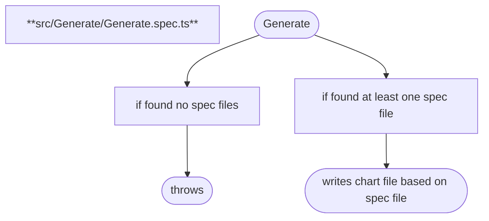
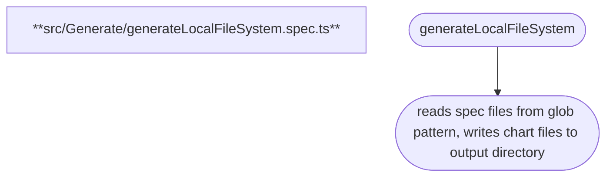
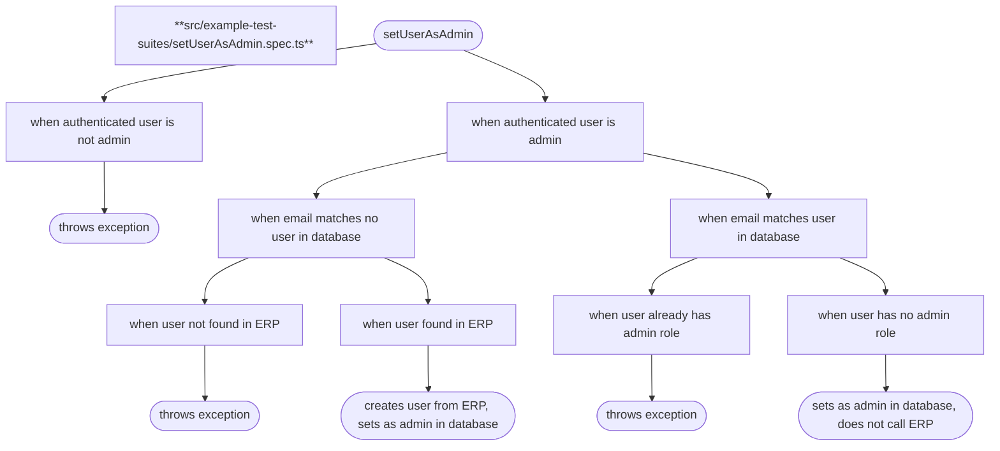
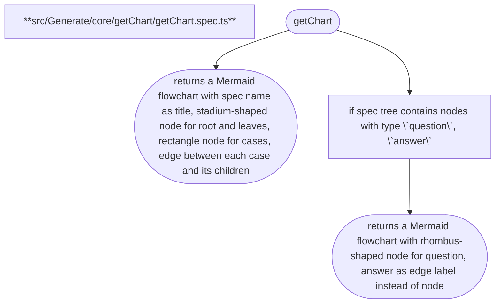
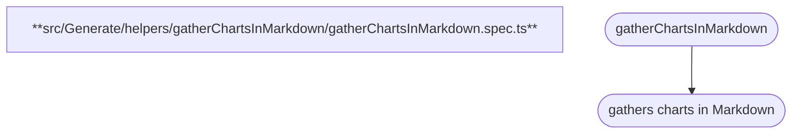

# speccharts

Jump to chart for each spec file:
<pre>└── src     ├── Generate     │   ├── <a href="#src-Generate-Generatespects">Generate.spec.ts</a>     │   ├── <a href="#src-Generate-generateLocalFileSystemspects">generateLocalFileSystem.spec.ts</a>     │   ├── helpers     │   │   ├── <a href="#src-Generate-helpers-getChartFilesspects">getChartFiles.spec.ts</a>     │   │   └── gatherChartsInMarkdown     │   │       └── <a href="#src-Generate-helpers-gatherChartsInMarkdown-gatherChartsInMarkdownspects">gatherChartsInMarkdown.spec.ts</a>     │   └── core     │       ├── getChart     │       │   └── <a href="#src-Generate-core-getChart-getChartspects">getChart.spec.ts</a>     │       └── getSpecTree     │           └── <a href="#src-Generate-core-getSpecTree-getSpecTreespects">getSpecTree.spec.ts</a>     └── example-test-suites         └── <a href="#src-example-test-suites-setUserAsAdminspects">setUserAsAdmin.spec.ts</a> </pre>

---

Spec file: <a href="../src/Generate/Generate.spec.ts">src/Generate/Generate.spec.ts</a>

---

Spec file: <a href="../src/Generate/generateLocalFileSystem.spec.ts">src/Generate/generateLocalFileSystem.spec.ts</a>

---

Spec file: <a href="../src/example-test-suites/setUserAsAdmin.spec.ts">src/example-test-suites/setUserAsAdmin.spec.ts</a>

---

Spec file: <a href="../src/Generate/helpers/getChartFiles.spec.ts">src/Generate/helpers/getChartFiles.spec.ts</a>

---

Spec file: <a href="../src/Generate/core/getChart/getChart.spec.ts">src/Generate/core/getChart/getChart.spec.ts</a>

---

Spec file: <a href="../src/Generate/core/getSpecTree/getSpecTree.spec.ts">src/Generate/core/getSpecTree/getSpecTree.spec.ts</a>

---

Spec file: <a href="../src/Generate/helpers/gatherChartsInMarkdown/gatherChartsInMarkdown.spec.ts">src/Generate/helpers/gatherChartsInMarkdown/gatherChartsInMarkdown.spec.ts</a>

<!-- ✴ Generated by speccharts • https://github.com/arnaudrenaud/speccharts • v0.1.9 -->
