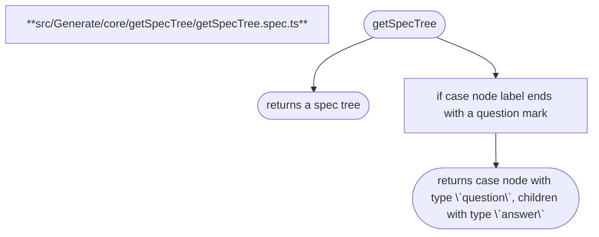
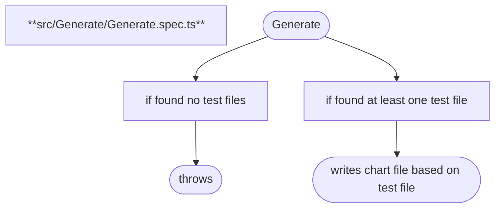
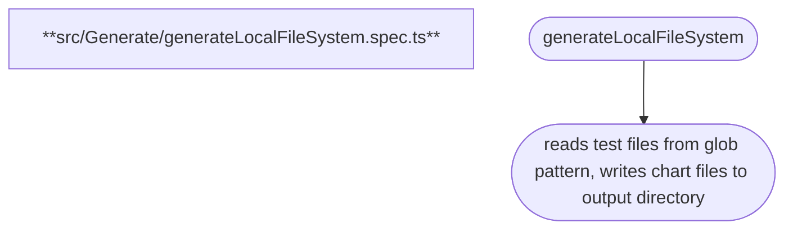
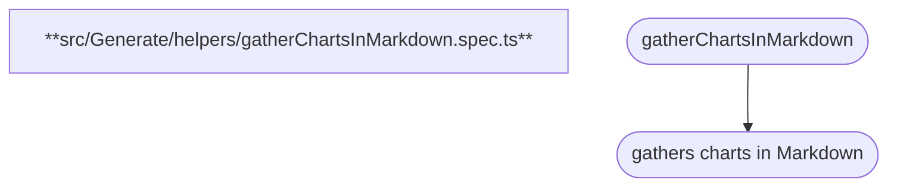
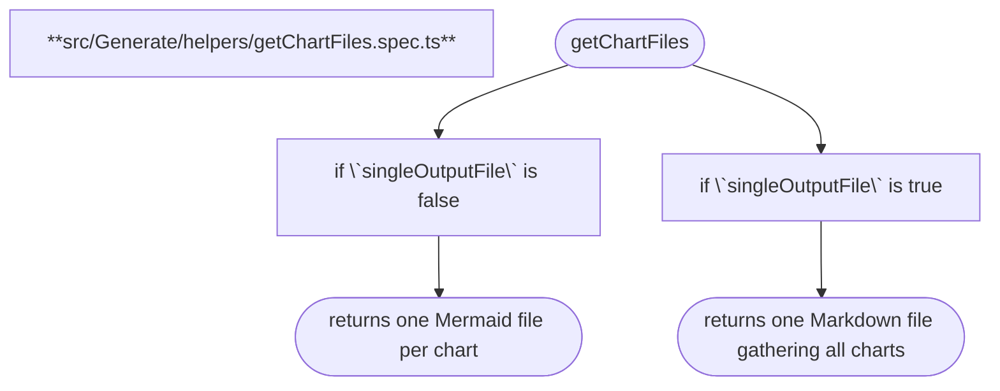

# Spec charts

<!-- Generated by speccharts -->
  

```mermaid
flowchart TD
title["**src/Generate/core/getChart/getChart.spec.ts**"]
N0(["getChart"])
N1(["returns a Mermaid flowchart with spec name as title, stadium-shaped node for root and leaves, rectangle node for cases, edge between each case and its children"])
N0 --> N1
N2["if spec tree contains nodes with type \`question\`, \`answer\`"]
N0 --> N2
N3(["returns a Mermaid flowchart with rhombus-shaped node for question, answer as edge label instead of node"])
N2 --> N3
```

---

```mermaid
flowchart TD
title["**src/Generate/core/getSpecTree/getSpecTree.spec.ts**"]
N0(["getSpecTree"])
N1(["returns a spec tree"])
N0 --> N1
N2["if case node label ends with a question mark"]
N0 --> N2
N3(["returns case node with type \`question\`, children with type \`answer\`"])
N2 --> N3
```

---

```mermaid
flowchart TD
title["**src/Generate/Generate.spec.ts**"]
N0(["Generate"])
N1["if found no test files"]
N0 --> N1
N2(["throws"])
N1 --> N2
N3["if found at least one test file"]
N0 --> N3
N4(["writes chart file based on test file"])
N3 --> N4
```

---

```mermaid
flowchart TD
title["**src/Generate/generateLocalFileSystem.spec.ts**"]
N0(["generateLocalFileSystem"])
N1(["reads test files from glob pattern, writes chart files to output directory"])
N0 --> N1
```

---

```mermaid
flowchart TD
title["**src/Generate/helpers/gatherChartsInMarkdown.spec.ts**"]
N0(["gatherChartsInMarkdown"])
N1(["gathers charts in Markdown"])
N0 --> N1
```

---

```mermaid
flowchart TD
title["**src/Generate/helpers/getChartFiles.spec.ts**"]
N0(["getChartFiles"])
N1["if \`singleOutputFile\` is false"]
N0 --> N1
N2(["returns one Mermaid file per chart"])
N1 --> N2
N3["if \`singleOutputFile\` is true"]
N0 --> N3
N4(["returns one Markdown file gathering all charts"])
N3 --> N4
```